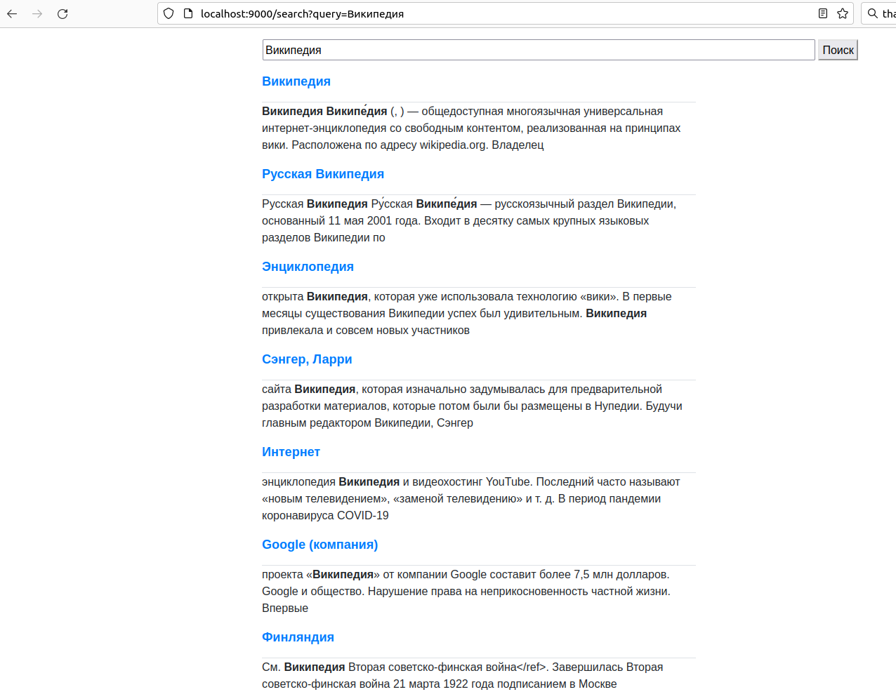

# search-front
Search-front is UI component for Wikipedia [search engine](https://github.com/Mikhail42/search-back).
This one specified for Russian Wikipedia, but you can change some settings and specify it for another language.

Example:

## Pre-requirement
See this section here: [search-back](https://github.com/Mikhail42/search-back)
- about 6 GB RAM
- about 12 GB on disk
- sbt, mvn, java 11, python 3
- *nix OS preferred due to [wikiextractor](https://github.com/attardi/wikiextractor)

## How to build
First, you need to perform most of the steps for search-back component.
Then you can create executable files via `sbt universal:packageZipTarball` (linux) or `sbt universal:packageBin` (windows)
(see [universal plugin](https://www.scala-sbt.org/sbt-native-packager/formats/universal.html)).

## How to run
Then go to `$projectDir/target/universal`, unpack archive, go to bin directory of unpacked and execute file.
You can see logs in `./logs` directory. You can configure log location in logback.xml.

## How to use
Open you browser and touch `localhost:9000`. Then type the search expression.
First request may take a few minutes (because of indexes should be parsed from files),
another requests performs in milliseconds.
